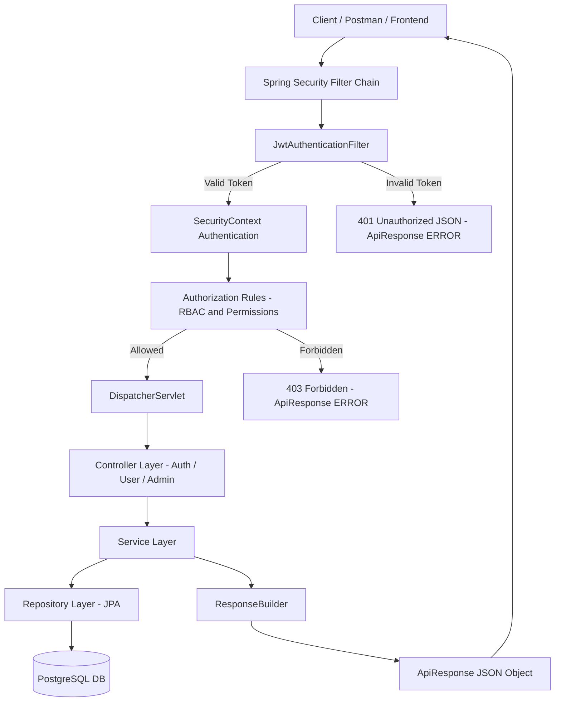

# SecurityApp

A production-grade **JWT Authentication & Authorization System** built using:

- **Spring Boot 4**
- **Spring Security 6**
- **JWT (Access + Refresh Tokens)**
- **PostgreSQL**
- **Dynamic Roles & Permissions (DB-Powered)**
- **Global Exception Handling & Validation**
- **Pagination, Sorting & Filtering**
- **Rate Limiting & CORS + Security Headers**
- **Soft Delete + Restore**
- **Swagger/OpenAPI Documentation**

This application provides a complete authentication module that is suitable for:

✔ Portfolio projects  
✔ Interview preparation  
✔ Real-world microservices  
✔ Scalable enterprise apps  

---

## 📌 Overview

SecurityApp implements a secure and scalable **JWT-based authentication & authorization** system with:

- User registration & login
- Access & Refresh token support
- Stateless authentication
- Role-based & Permission-based authorization (**USER**, **ADMIN** with fine-grained permissions)
- Clean layered architecture (Controller → Service → Repository)
- Standardized API responses via `ApiResponse` + `ResponseBuilder`
- Field-level input validation
- Global exception handling with custom exception hierarchy
- Rate limiting on login to prevent brute-force attacks
- Pagination, sorting & filtering for admin user listing
- CORS configuration & security headers
- Auto-generated Swagger UI documentation

All REST endpoints are versioned under:  
`/api/v1/...`

---

## 🏛 System Architecture (Mermaid Diagram)

> **IMPORTANT:**  
> GitHub requires Mermaid diagrams to be wrapped inside ```mermaid.



---

## 📁 Project Structure

```text
src/main/java/com/example/securityapp
│
├── SecurityappApplication.java
│
├── config/
│   ├── SecurityConfig.java
│   ├── JwtUtil.java
│   ├── JwtAuthenticationFilter.java
│   ├── JwtAuthenticationEntryPoint.java
│   └── OpenApiConfig.java
│
├── controller/
│   ├── AuthController.java
│   ├── UserController.java
│   └── AdminController.java
│
├── dto/
│   ├── ApiResponse.java
│   ├── AuthRequest.java
│   ├── AuthResponse.java
│   ├── RegisterRequest.java
│   ├── UpdateUserRequest.java
│   ├── AdminUpdateUserRequest.java
│   └── RolePermissionUpdateRequest.java
│
├── entity/
│   ├── UserEntity.java
│   ├── RoleEntity.java
│   ├── PermissionEntity.java
│   └── RefreshToken.java
│
├── repository/
│   ├── UserRepository.java
│   ├── RoleRepository.java
│   ├── PermissionRepository.java
│   └── RefreshTokenRepository.java
│
├── service/
│   ├── AuthService.java
│   ├── UserService.java
│   └── impl/
│       ├── AuthServiceImpl.java
│       └── UserServiceImpl.java
│
├── security/
│   ├── LoginRateLimiter.java
│   └── JwtPermissionExtractor.java
│
└── utils/
    └── ResponseBuilder.java
```

---

# SecurityApp – Full RBAC (Role & Permission) System

A production-grade **JWT Authentication & Authorization System** featuring a fully **dynamic Role-Based Access Control (RBAC)** and **Permission Management** implemented using:

- Spring Boot 4  
- Spring Security 6  
- JWT (Access + Refresh Tokens)  
- PostgreSQL  
- Dynamic Roles & Permissions (DB-Powered)  
- Global Exception Handling  
- Pagination, Sorting & Filtering  
- Rate Limiting  
- Soft Delete + Restore  
- Swagger/OpenAPI Docs  

This project is built for:  
✔ Real-world microservices  
✔ Portfolio & resumes  
✔ Enterprise-level authentication  
✔ Interview preparation  

## 📌 Key Features

### 🔐 Authentication
- Register user (default `USER` role or custom role)
- Login with JWT (Access + Refresh Tokens)
- Refresh token rotation
- Strong password hashing (BCrypt)
- Rate-limiting on login

### 🛡 Authorization (DB-Driven RBAC)
- Roles stored in DB (`roles` table)
- Permissions stored in DB (`permissions` table)
- Role → Permission (Many-to-Many)
- User → Role (Many-to-One)
- JWT dynamically contains `role` + `permissions`
- `@PreAuthorize` with `hasAuthority("<PERMISSION>")`

### 👤 User Management
- User profile fetch
- Update profile
- Soft delete
- Restore deleted users
- Admin updating user role

### 🏛 Admin & RBAC APIs
- Create roles
- Create permissions
- Assign permissions to roles
- Update role permissions
- List all roles & permissions

### 📊 Pagination / Sorting / Filtering
- Admin user listing with:
  - `page`, `size`
  - `sortBy`, `direction`
  - `emailFilter`

### 🛡 Security
- JWT Authentication Filter
- Custom 401 & 403 JSON response
- CORS configuration
- CSP headers
- Stateless authentication

### 📕 API Documentation
Swagger UI:  
`http://localhost:8080/swagger-ui/index.html`

## 🗄️ Database ER Diagram (Full Dynamic RBAC)

```mermaid
    USER_ENTITY {
        bigint id PK
        varchar email
        varchar password
        varchar name
        boolean deleted
        bigint role_id FK
    }

    ROLE_ENTITY {
        bigint id PK
        varchar name
    }

    PERMISSION_ENTITY {
        bigint id PK
        varchar name
    }

    REFRESH_TOKEN {
        bigint id PK
        varchar token
        timestamp expiry
        boolean revoked
        bigint user_id FK
    }

    ROLE_PERMISSIONS {
        bigint role_id FK
        bigint permission_id FK
    }

    USER_ENTITY ||--o{ REFRESH_TOKEN : "has many"
    USER_ENTITY }o--|| ROLE_ENTITY : "assigned role"
    ROLE_ENTITY ||--o{ ROLE_PERMISSIONS : "has permissions"
    PERMISSION_ENTITY ||--o{ ROLE_PERMISSIONS : "mapped to roles"
```

---

## 🎯 Features

### 🔐 Authentication
- Register user (default `USER` role or custom role)
- Login with JWT (Access + Refresh Tokens)
- Refresh token rotation
- Strong password hashing (BCrypt)
- Rate-limiting on login

### 🛡 Authorization
- Roles stored in DB (`roles` table)
- Permissions stored in DB (`permissions` table)
- Role → Permission (Many-to-Many)
- User → Role (Many-to-One)
- JWT dynamically contains `role` + `permissions`
- `@PreAuthorize` with `hasAuthority("<PERMISSION>")`

### 👤 User Management
- User profile fetch
- Update profile
- Soft delete
- Restore deleted users
- Admin updating user role

### 🏛 Admin & RBAC APIs
- Create roles
- Create permissions
- Assign permissions to roles
- Update role permissions
- List all roles & permissions

### 📊 Pagination, Sorting, Filtering
Admin user list supports:
- `page`
- `size`
- `sortBy`
- `direction`
- `emailFilter`

### 🚦 Rate Limiting
- Prevent brute-force login attempts
- Custom limit per user/email

### 🛡 Security
- JWT Authentication Filter
- Custom 401 & 403 JSON response
- CORS configuration
- CSP headers
- Stateless authentication

### ⚠ Exception Hierarchy
- `ResourceNotFoundException`
- `BadRequestException`
- `UnauthorizedException`
- `ForbiddenException`
- `TooManyRequestsException`
- Validation errors handled uniformly

### 📜 Swagger/OpenAPI
Access at:
```
http://localhost:8080/swagger-ui/index.html
```

---

## ⚙️ Tech Stack

| Technology            | Purpose                             |
|-----------------------|-------------------------------------|
| Spring Boot 4         | REST API backend                    |
| Spring Security 6     | Authentication & Authorization      |
| JWT (JJWT)            | Access + Refresh Tokens             |
| PostgreSQL            | Database                            |
| Maven                 | Build tool                          |
| Lombok                | Boilerplate reduction               |
| Springdoc OpenAPI     | Swagger UI                          |
| Logback + SLF4J       | Logging                             |

---

## 🗄️ Setup PostgreSQL Database

```sql
CREATE DATABASE securitydb;
```

---

## ⚙️ application.properties

```properties
spring.datasource.url=jdbc:postgresql://localhost:5432/securitydb
spring.datasource.username=postgres
spring.datasource.password=your_password

spring.jpa.hibernate.ddl-auto=update
spring.jpa.show-sql=true
```

---

## ▶️ Run the Application

```bash
mvn spring-boot:run
```

---

## 🔥 API Endpoints (v1)

### Auth APIs

| Method | Endpoint                        | Description               |
| ------ | ------------------------------- | ------------------------- |
| POST   | /api/v1/auth/register           | Register Normal User      |
| POST   | /api/v1/auth/register-with-role | Register with custom role |
| POST   | /api/v1/auth/login              | Login                     |
| POST   | /api/v1/auth/refresh-token      | Refresh access token      |


---

### User APIs

| Method | Endpoint             | Permission  |
| ------ | -------------------- | ----------- |
| GET    | /api/v1/user/profile | USER_READ   |
| PUT    | /api/v1/user/update  | USER_UPDATE |


---

### Admin APIs

| Method | Endpoint                         | Permission         |
| ------ | -------------------------------- | ------------------ |
| GET    | /api/v1/admin/users              | ADMIN_READ_USERS   |
| PUT    | /api/v1/admin/users/{id}         | ADMIN_MANAGE_USERS |
| DELETE | /api/v1/admin/users/{id}         | ADMIN_MANAGE_USERS |
| PUT    | /api/v1/admin/users/{id}/restore | ADMIN_MANAGE_USERS |

---

## 🔑 Authentication Flow

1. Register → stored in DB with role
2. Login → receive `accessToken` + `refreshToken`
3. Use `accessToken` in request header:
```bash
Authorization: Bearer <accessToken>
```
4. When expired → user calls refresh API
5. JWT contains:
email
role
permissions[]

```
Authorization: Bearer <accessToken>
```

4. When expired → call `/api/v1/auth/refresh-token`

---

## 🧪 cURL Examples

### Register User

```bash
curl -X POST http://localhost:8080/api/v1/auth/register \
  -H "Content-Type: application/json" \
  -d '{"email":"user@example.com","password":"P@ssw0rd!","name":"User"}'
```
### Register user with custom role
```bash
curl -X POST http://localhost:8080/api/v1/auth/register-with-role \
  -H "Content-Type: application/json" \
  -d '{"email":"john@example.com","password":"Pass123!","name":"John","role":"ADMIN"}'

```

### Login

```bash
curl -X POST http://localhost:8080/api/v1/auth/login \
  -H "Content-Type: application/json" \
  -d '{"email":"user@example.com","password":"P@ssw0rd!"}'
```

### Refresh Token

```bash
curl -X POST http://localhost:8080/api/v1/auth/refresh-token \
  -H "Content-Type: application/json" \
  -d '{"refreshToken":"<REFRESH_TOKEN>"}'
```
### Create a role
```bash 
curl -X POST http://localhost:8080/api/v1/admin/roles \
  -H "Authorization: Bearer <ADMIN_TOKEN>" \
  -H "Content-Type: application/json" \
  -d '{"name":"MANAGER"}'
```

### Create permission
```bash
curl -X POST http://localhost:8080/api/v1/admin/permissions \
  -H "Authorization: Bearer <ADMIN_TOKEN>" \
  -H "Content-Type: application/json" \
  -d '{"name":"MANAGER_VIEW"}'
```

### Assign permissions to role
```bash
curl -X PUT http://localhost:8080/api/v1/admin/roles/MANAGER/permissions \
  -H "Authorization: Bearer <ADMIN_TOKEN>" \
  -H "Content-Type: application/json" \
  -d '{ "permissions": ["MANAGER_VIEW", "MANAGER_UPDATE"] }'
```
### Restore User
```bash
curl -X PUT http://localhost:8080/api/v1/admin/users/10/restore \
  -H "Authorization: Bearer <ADMIN_TOKEN>"
```

### Register Admin

```bash
curl -X POST http://localhost:8080/api/v1/auth/register-admin \
  -H "Authorization: Bearer <ADMIN_ACCESS_TOKEN>" \
  -H "Content-Type: application/json" \
  -d '{"email":"admin@example.com","password":"AdminPass123","name":"Root Admin"}'
```

## 🧹 Soft Delete

Soft delete is enabled via Hibernate native soft delete:
```aiignore
DELETE marks row as deleted = true
```
All JPA queries auto-exclude deleted rows
Restore via:
```bash
PUT /api/v1/admin/users/{id}/restore
```

---

## 📦 POSTMAN COLLECTION JSON  
Save as: `SecurityApp.postman_collection.json`

```json
{
  "info": {
    "name": "SecurityApp RBAC API v1",
    "_postman_id": "securityapp-rbac-collection-001",
    "description": "Complete Postman collection for SecurityApp RBAC API including Auth, Users, Admin, RBAC management, Refresh Token.",
    "schema": "https://schema.getpostman.com/json/collection/v2.1.0/collection.json"
  },
  "variable": [
    { "key": "baseUrl", "value": "http://localhost:8080" },
    { "key": "accessToken", "value": "" },
    { "key": "refreshToken", "value": "" },
    { "key": "adminAccessToken", "value": "" }
  ],
  "item": [
    {
      "name": "Auth - Register (Dynamic Role & Permissions)",
      "request": {
        "method": "POST",
        "header": [{ "key": "Content-Type", "value": "application/json" }],
        "url": "{{baseUrl}}/api/v1/auth/register",
        "body": {
          "mode": "raw",
          "raw": "{\n  \"email\": \"admin@example.com\",\n  \"password\": \"Admin@123\",\n  \"name\": \"Super Admin\",\n  \"role\": \"admin\",\n  \"permissions\": [\n    \"ADMIN_READ_USERS\",\n    \"ADMIN_MANAGE_USERS\",\n    \"ADMIN_RESTORE_USERS\",\n    \"RBAC_MANAGE_ROLES\",\n    \"RBAC_MANAGE_PERMISSIONS\"\n  ]\n}"
        }
      }
    },
    {
      "name": "Auth - Login",
      "event": [
        {
          "listen": "test",
          "script": {
            "exec": [
              "var response = pm.response.json();",
              "if (response.data) {",
              "  pm.collectionVariables.set('accessToken', response.data.accessToken);",
              "  pm.collectionVariables.set('refreshToken', response.data.refreshToken);",
              "}"
            ]
          }
        }
      ],
      "request": {
        "method": "POST",
        "header": [{ "key": "Content-Type", "value": "application/json" }],
        "url": "{{baseUrl}}/api/v1/auth/login",
        "body": {
          "mode": "raw",
          "raw": "{\n  \"email\": \"admin@example.com\",\n  \"password\": \"Admin@123\"\n}"
        }
      }
    },
    {
      "name": "Auth - Refresh Token",
      "event": [
        {
          "listen": "test",
          "script": {
            "exec": [
              "var response = pm.response.json();",
              "if (response.data) {",
              "  pm.collectionVariables.set('accessToken', response.data.accessToken);",
              "}"
            ]
          }
        }
      ],
      "request": {
        "method": "POST",
        "header": [{ "key": "Content-Type", "value": "application/json" }],
        "url": "{{baseUrl}}/api/v1/auth/refresh-token",
        "body": {
          "mode": "raw",
          "raw": "{\n  \"refreshToken\": \"{{refreshToken}}\"\n}"
        }
      }
    },
    {
      "name": "User - Get Profile",
      "request": {
        "method": "GET",
        "header": [{ "key": "Authorization", "value": "Bearer {{accessToken}}" }],
        "url": "{{baseUrl}}/api/v1/user/profile"
      }
    },
    {
      "name": "User - Update Profile",
      "request": {
        "method": "PUT",
        "header": [
          { "key": "Authorization", "value": "Bearer {{accessToken}}" },
          { "key": "Content-Type", "value": "application/json" }
        ],
        "url": "{{baseUrl}}/api/v1/user/update",
        "body": {
          "mode": "raw",
          "raw": "{\n  \"name\": \"Updated User Name\"\n}"
        }
      }
    },
    {
      "name": "Admin - Get Users (Paged)",
      "request": {
        "method": "GET",
        "header": [{ "key": "Authorization", "value": "Bearer {{accessToken}}" }],
        "url": "{{baseUrl}}/api/v1/admin/users?page=0&size=10&sortBy=email&direction=asc"
      }
    },
    {
      "name": "Admin - Update User (Name + Role)",
      "request": {
        "method": "PUT",
        "header": [
          { "key": "Authorization", "value": "Bearer {{accessToken}}" },
          { "key": "Content-Type", "value": "application/json" }
        ],
        "url": "{{baseUrl}}/api/v1/admin/users/5",
        "body": {
          "mode": "raw",
          "raw": "{\n  \"name\": \"Updated Name\",\n  \"roleName\": \"MANAGER\"\n}"
        }
      }
    },
    {
      "name": "Admin - Soft Delete User",
      "request": {
        "method": "DELETE",
        "header": [{ "key": "Authorization", "value": "Bearer {{accessToken}}" }],
        "url": "{{baseUrl}}/api/v1/admin/users/5"
      }
    },
    {
      "name": "Admin - Restore User",
      "request": {
        "method": "PUT",
        "header": [{ "key": "Authorization", "value": "Bearer {{accessToken}}" }],
        "url": "{{baseUrl}}/api/v1/admin/users/5/restore"
      }
    },
    {
      "name": "RBAC - Create Role",
      "request": {
        "method": "POST",
        "header": [
          { "key": "Authorization", "value": "Bearer {{accessToken}}" },
          { "key": "Content-Type", "value": "application/json" }
        ],
        "url": "{{baseUrl}}/api/v1/admin/roles",
        "body": {
          "mode": "raw",
          "raw": "{\n  \"name\": \"MANAGER\"\n}"
        }
      }
    },
    {
      "name": "RBAC - List Roles",
      "request": {
        "method": "GET",
        "header": [{ "key": "Authorization", "value": "Bearer {{accessToken}}" }],
        "url": "{{baseUrl}}/api/v1/admin/roles"
      }
    },
    {
      "name": "RBAC - Create Permission",
      "request": {
        "method": "POST",
        "header": [
          { "key": "Authorization", "value": "Bearer {{accessToken}}" },
          { "key": "Content-Type", "value": "application/json" }
        ],
        "url": "{{baseUrl}}/api/v1/admin/permissions",
        "body": {
          "mode": "raw",
          "raw": "{\n  \"name\": \"USER_READ\"\n}"
        }
      }
    },
    {
      "name": "RBAC - List Permissions",
      "request": {
        "method": "GET",
        "header": [{ "key": "Authorization", "value": "Bearer {{accessToken}}" }],
        "url": "{{baseUrl}}/api/v1/admin/permissions"
      }
    },
    {
      "name": "RBAC - Update Role Permissions",
      "request": {
        "method": "PUT",
        "header": [
          { "key": "Authorization", "value": "Bearer {{accessToken}}" },
          { "key": "Content-Type", "value": "application/json" }
        ],
        "url": "{{baseUrl}}/api/v1/admin/roles/MANAGER/permissions",
        "body": {
          "mode": "raw",
          "raw": "{\n  \"permissions\": [\"USER_READ\", \"USER_UPDATE\"]\n}"
        }
      }
    }
  ]
}
```

---

## 📄 License

Licensed under the **MIT License**.

