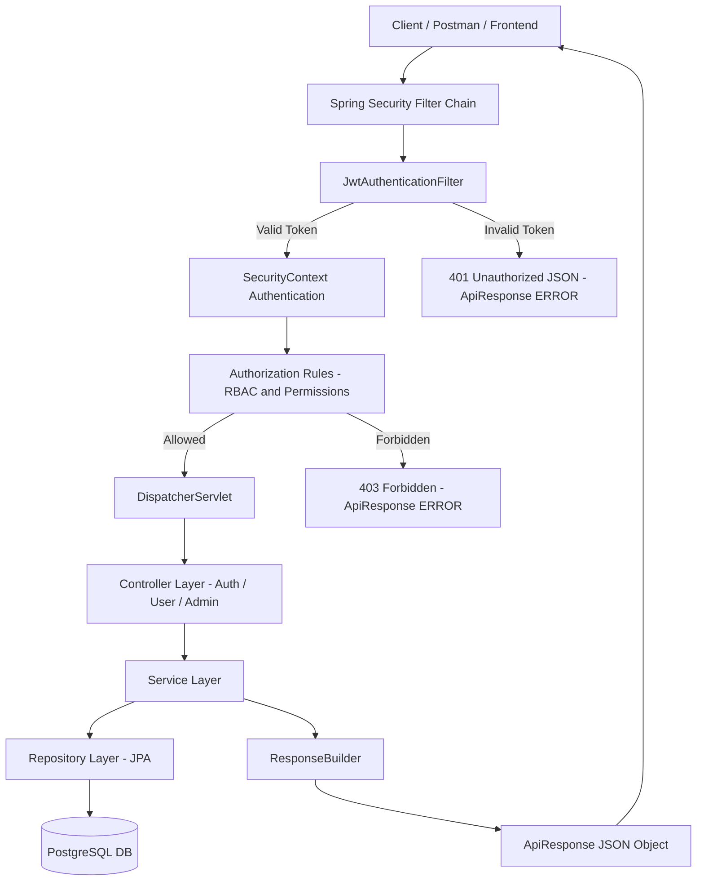
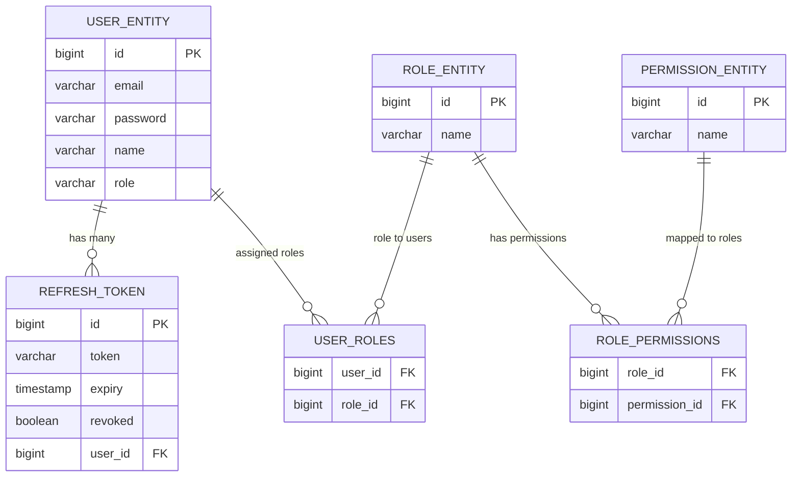

# SecurityApp

A production-grade **JWT Authentication & Authorization System** built using:

- **Spring Boot 4**
- **Spring Security 6**
- **JWT (Access + Refresh Tokens)**
- **PostgreSQL**
- **Role & Permission Based RBAC**
- **Global Exception Handling & Validation**
- **Pagination, Sorting & Filtering**
- **Rate Limiting & CORS + Security Headers**
- **Swagger/OpenAPI Documentation**

This application provides a complete authentication module that is suitable for:

✔ Portfolio projects  
✔ Interview preparation  
✔ Real-world microservices  
✔ Scalable enterprise apps  

---

## 📌 Overview

SecurityApp implements a secure and scalable **JWT-based authentication & authorization** system with:

- User registration & login
- Access & Refresh token support
- Stateless authentication
- Role-based & Permission-based authorization (**USER**, **ADMIN** with fine-grained permissions)
- Clean layered architecture (Controller → Service → Repository)
- Standardized API responses via `ApiResponse` + `ResponseBuilder`
- Field-level input validation
- Global exception handling with custom exception hierarchy
- Rate limiting on login to prevent brute-force attacks
- Pagination, sorting & filtering for admin user listing
- CORS configuration & security headers
- Auto-generated Swagger UI documentation

All REST endpoints are versioned under:  
`/api/v1/...`

---

## 🏛 System Architecture (Mermaid Diagram)

> **IMPORTANT:**  
> GitHub requires Mermaid diagrams to be wrapped inside ```mermaid.



---

## 📁 Project Structure

```text
src/main/java/com/example/securityapp
│
├── SecurityappApplication.java
│
├── config/
│   ├── SecurityConfig.java
│   ├── JwtUtil.java
│   ├── JwtAuthenticationFilter.java
│   ├── JwtAuthenticationEntryPoint.java
│   └── OpenApiConfig.java
│
├── controller/
│   ├── AuthController.java         # /api/v1/auth/*
│   ├── UserController.java         # /api/v1/user/*
│   └── AdminController.java        # /api/v1/admin/*
│
├── dto/
│   ├── ApiResponse.java            # Standard response wrapper
│   ├── AuthRequest.java
│   ├── AuthResponse.java           # accessToken + refreshToken
│   ├── RegisterRequest.java
│   ├── UpdateUserRequest.java
│   └── AdminUpdateUserRequest.java
│
├── entity/
│   ├── UserEntity.java
│   ├── RefreshToken.java
│   ├── RoleEntity.java             # (optional persistence)
│   └── PermissionEntity.java       # (optional persistence)
│
├── exception/
│   ├── GlobalExceptionHandler.java
│   ├── ResourceNotFoundException.java
│   ├── BadRequestException.java
│   ├── UnauthorizedException.java
│   ├── ForbiddenException.java
│   └── TooManyRequestsException.java
│
├── repository/
│   ├── UserRepository.java
│   ├── RefreshTokenRepository.java
│   ├── RoleRepository.java
│   └── PermissionRepository.java
│
├── security/
│   ├── Permissions.java
│   ├── RolePermissionMapper.java
│   └── LoginRateLimiter.java
│
├── service/
│   ├── AuthService.java
│   ├── UserService.java
│   └── impl/
│       ├── AuthServiceImpl.java
│       └── UserServiceImpl.java
│
└── utils/
    └── ResponseBuilder.java
```

---

## 🗄️ ER Diagram (Mermaid ERD)



---

## 🎯 Features

### 🔐 Authentication
- Register user
- Login + JWT generation
- Access + Refresh Tokens
- Refresh token rotation
- Stateless security (`SessionCreationPolicy.STATELESS`)

### 🛡 Authorization
- Role Based Access Control (RBAC)
- Permission based (fine-grained)
- `@PreAuthorize` with `hasAuthority`
- Custom denied & unauthorized handlers

### 👤 User Features
- Get own profile
- Update own profile

### 🏛 Admin Features
- List users (paged & filtered)
- Update any user
- Delete users
- Register new admins

### 📊 Pagination, Sorting, Filtering
Admin user list supports:
- `page`
- `size`
- `sortBy`
- `direction`
- `emailFilter`

### 🚦 Rate Limiting
- Prevent brute-force login attempts
- Custom limit per user/email

### 🌐 CORS + Security Headers
- CORS allowed origins
- CSP (Content Security Policy)
- Frame options denied
- Secure headers

### ⚠ Exception Hierarchy
- `ResourceNotFoundException`
- `BadRequestException`
- `UnauthorizedException`
- `ForbiddenException`
- `TooManyRequestsException`
- Validation errors handled uniformly

### 📜 Swagger/OpenAPI
Access at:

```
http://localhost:8080/swagger-ui/index.html
```

---

## ⚙️ Tech Stack

| Technology            | Purpose                             |
|-----------------------|-------------------------------------|
| Spring Boot 4         | REST API backend                    |
| Spring Security 6     | Authentication & Authorization      |
| JWT (JJWT)            | Access + Refresh Tokens             |
| PostgreSQL            | Database                            |
| Maven                 | Build tool                          |
| Lombok                | Boilerplate reduction               |
| Springdoc OpenAPI     | Swagger UI                          |
| Logback + SLF4J       | Logging                             |

---

## 🗄️ Setup PostgreSQL Database

```sql
CREATE DATABASE securitydb;
```

---

## ⚙️ application.properties

```properties
spring.datasource.url=jdbc:postgresql://localhost:5432/securitydb
spring.datasource.username=postgres
spring.datasource.password=your_password

spring.jpa.hibernate.ddl-auto=update
spring.jpa.show-sql=true
```

---

## ▶️ Run the Application

```bash
mvn spring-boot:run
```

---

## 🔥 API Endpoints (v1)

### Auth APIs

| Method | Endpoint                        | Description                     | Auth  |
|--------|---------------------------------|---------------------------------|-------|
| POST   | /api/v1/auth/register           | Register user                   | Public |
| POST   | /api/v1/auth/login              | Login                           | Public |
| POST   | /api/v1/auth/refresh-token      | Refresh Access Token            | Public |
| POST   | /api/v1/auth/register-admin     | Register admin                  | ADMIN |

---

### User APIs

| Method | Endpoint                       | Description        | Permission    |
|--------|--------------------------------|--------------------|----------------|
| GET    | /api/v1/user/profile           | Get profile        | USER_READ     |
| PUT    | /api/v1/user/update            | Update profile     | USER_UPDATE   |

---

### Admin APIs

| Method | Endpoint                         | Description           | Permission              |
|--------|----------------------------------|-----------------------|--------------------------|
| GET    | /api/v1/admin/users              | Get users list        | ADMIN_READ_USERS         |
| PUT    | /api/v1/admin/users/{id}         | Update user           | ADMIN_MANAGE_USERS       |
| DELETE | /api/v1/admin/users/{id}         | Delete user           | ADMIN_MANAGE_USERS       |

---

## 🔑 Authentication Flow

1. Register  
2. Login → receive `accessToken` + `refreshToken`
3. Use `accessToken` in request header:

```
Authorization: Bearer <accessToken>
```

4. When expired → call `/api/v1/auth/refresh-token`

---

## 🧪 cURL Examples

### Register User

```bash
curl -X POST http://localhost:8080/api/v1/auth/register \
  -H "Content-Type: application/json" \
  -d '{"email":"user@example.com","password":"P@ssw0rd!","name":"Test User"}'
```

### Login

```bash
curl -X POST http://localhost:8080/api/v1/auth/login \
  -H "Content-Type: application/json" \
  -d '{"email":"user@example.com","password":"P@ssw0rd!"}'
```

### Refresh Token

```bash
curl -X POST http://localhost:8080/api/v1/auth/refresh-token \
  -H "Content-Type: application/json" \
  -d '{"refreshToken":"<REFRESH_TOKEN>"}'
```

### Register Admin

```bash
curl -X POST http://localhost:8080/api/v1/auth/register-admin \
  -H "Authorization: Bearer <ADMIN_ACCESS_TOKEN>" \
  -H "Content-Type: application/json" \
  -d '{"email":"admin@example.com","password":"AdminPass123","name":"Root Admin"}'
```

---

## 📦 POSTMAN COLLECTION JSON  
Save as: `SecurityApp.postman_collection.json`

```json
{
  "info": {
    "name": "SecurityApp API v1",
    "_postman_id": "securityapp-collection-001",
    "description": "Full Postman Collection for SecurityApp API including Auth, Users, Admin routes, Refresh Token, RBAC, Pagination, Validation.",
    "schema": "https://schema.getpostman.com/json/collection/v2.1.0/collection.json"
  },
  "variable": [
    {
      "key": "baseUrl",
      "value": "http://localhost:8080"
    },
    {
      "key": "accessToken",
      "value": ""
    },
    {
      "key": "refreshToken",
      "value": ""
    },
    {
      "key": "adminAccessToken",
      "value": ""
    }
  ],
  "item": [

    {
      "name": "Auth — Register User",
      "request": {
        "method": "POST",
        "header": [
          { "key": "Content-Type", "value": "application/json" }
        ],
        "body": {
          "mode": "raw",
          "raw": "{\n  \"email\": \"user@example.com\",\n  \"password\": \"P@ssw0rd!\",\n  \"name\": \"Test User\"\n}"
        },
        "url": {
          "raw": "{{baseUrl}}/api/v1/auth/register",
          "host": ["{{baseUrl}}"],
          "path": ["api","v1","auth","register"]
        }
      }
    },

    {
      "name": "Auth — Login",
      "event": [
        {
          "listen": "test",
          "script": {
            "exec": [
              "var response = pm.response.json();",
              "pm.collectionVariables.set(\"accessToken\", response.data.accessToken);",
              "pm.collectionVariables.set(\"refreshToken\", response.data.refreshToken);"
            ]
          }
        }
      ],
      "request": {
        "method": "POST",
        "header": [
          { "key": "Content-Type", "value": "application/json" }
        ],
        "body": {
          "mode": "raw",
          "raw": "{\n  \"email\": \"user@example.com\",\n  \"password\": \"P@ssw0rd!\"\n}"
        },
        "url": {
          "raw": "{{baseUrl}}/api/v1/auth/login",
          "host": ["{{baseUrl}}"],
          "path": ["api","v1","auth","login"]
        }
      }
    },

    {
      "name": "Auth — Refresh Token",
      "event": [
        {
          "listen": "test",
          "script": {
            "exec": [
              "var response = pm.response.json();",
              "pm.collectionVariables.set(\"accessToken\", response.data.accessToken);"
            ]
          }
        }
      ],
      "request": {
        "method": "POST",
        "header": [
          { "key": "Content-Type", "value": "application/json" }
        ],
        "body": {
          "mode": "raw",
          "raw": "{\n  \"refreshToken\": \"{{refreshToken}}\"\n}"
        },
        "url": {
          "raw": "{{baseUrl}}/api/v1/auth/refresh-token",
          "host": ["{{baseUrl}}"],
          "path": ["api","v1","auth","refresh-token"]
        }
      }
    },

    {
      "name": "Auth — Register Admin (needs Admin Token)",
      "request": {
        "method": "POST",
        "header": [
          { "key": "Authorization", "value": "Bearer {{adminAccessToken}}" },
          { "key": "Content-Type", "value": "application/json" }
        ],
        "body": {
          "mode": "raw",
          "raw": "{\n  \"email\": \"admin2@example.com\",\n  \"password\": \"AdminPass123\",\n  \"name\": \"Admin Two\"\n}"
        },
        "url": {
          "raw": "{{baseUrl}}/api/v1/auth/register-admin",
          "host": ["{{baseUrl}}"],
          "path": ["api","v1","auth","register-admin"]
        }
      }
    },

    {
      "name": "User — Get Profile (USER_READ)",
      "request": {
        "method": "GET",
        "header": [
          { "key": "Authorization", "value": "Bearer {{accessToken}}" }
        ],
        "url": {
          "raw": "{{baseUrl}}/api/v1/user/profile",
          "host": ["{{baseUrl}}"],
          "path": ["api","v1","user","profile"]
        }
      }
    },

    {
      "name": "User — Update Profile (USER_UPDATE)",
      "request": {
        "method": "PUT",
        "header": [
          { "key": "Authorization", "value": "Bearer {{accessToken}}" },
          { "key": "Content-Type", "value": "application/json" }
        ],
        "body": {
          "mode": "raw",
          "raw": "{\n  \"name\": \"Updated Test User\"\n}"
        },
        "url": {
          "raw": "{{baseUrl}}/api/v1/user/update",
          "host": ["{{baseUrl}}"],
          "path": ["api","v1","user","update"]
        }
      }
    },

    {
      "name": "Admin — List Users (pagination + sorting + filtering)",
      "request": {
        "method": "GET",
        "header": [
          { "key": "Authorization", "value": "Bearer {{adminAccessToken}}" }
        ],
        "url": {
          "raw": "{{baseUrl}}/api/v1/admin/users?page=0&size=10&sortBy=email&direction=asc&emailFilter=gmail",
          "host": ["{{baseUrl}}"],
          "path": ["api","v1","admin","users"],
          "query": [
            { "key": "page", "value": "0" },
            { "key": "size", "value": "10" },
            { "key": "sortBy", "value": "email" },
            { "key": "direction", "value": "asc" },
            { "key": "emailFilter", "value": "gmail" }
          ]
        }
      }
    },

    {
      "name": "Admin — Update User (ADMIN_MANAGE_USERS)",
      "request": {
        "method": "PUT",
        "header": [
          { "key": "Authorization", "value": "Bearer {{adminAccessToken}}" },
          { "key": "Content-Type", "value": "application/json" }
        ],
        "body": {
          "mode": "raw",
          "raw": "{\n  \"name\": \"Updated Admin User\",\n  \"role\": \"ADMIN\"\n}"
        },
        "url": {
          "raw": "{{baseUrl}}/api/v1/admin/users/2",
          "host": ["{{baseUrl}}"],
          "path": ["api","v1","admin","users","2"]
        }
      }
    },

    {
      "name": "Admin — Delete User (ADMIN_MANAGE_USERS)",
      "request": {
        "method": "DELETE",
        "header": [
          { "key": "Authorization", "value": "Bearer {{adminAccessToken}}" }
        ],
        "url": {
          "raw": "{{baseUrl}}/api/v1/admin/users/2",
          "host": ["{{baseUrl}}"],
          "path": ["api","v1","admin","users","2"]
        }
      }
    }

  ]
}

```

---

## 📄 License

Licensed under the **MIT License**.

